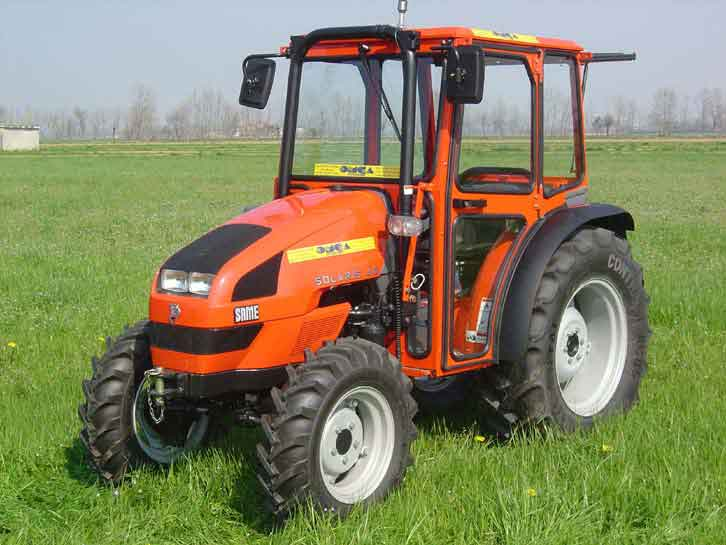

# Cascina Fontana


> Sito istituzionale della Società Agricola Cascina Fontana S.S. — produzione agricola gestita con precisione, Rodigo (MN).

---

## ⚡ Stack

Zero framework. Zero dipendenze runtime. Carica in meno di un secondo.

| | Tecnologia | Motivo |
|--|-----------|--------|
| 📄 | **HTML5** semantico | Struttura accessibile, SEO nativo |
| 🎨 | **CSS3** puro | Custom properties, Grid, Keyframes — niente librerie |
| ⚙️ | **Vanilla JS** | IntersectionObserver, form async — ~3 KB |
| 🔤 | **NType-82** | Display heading font (Nothing) |
| 🔤 | **Lettera Mono LL** | Mono body + labels |
| 🔤 | **Ndot-57** | Dot-matrix per dati numerici |
| 📬 | **Web3Forms** | Form contatti serverless |
| 🚀 | **Vercel** | Deploy statico, no build step |

Font caricati da [`xeji01/nothingfont`](https://github.com/xeji01/nothingfont) via `@font-face`.

---

## 🎨 Design system

```
Background  #F9F7F7  ░░░  Warm off-white
Borders     #DBE2EF  ░░░  Blue-grey light
Accent      #3F72AF  ███  Medium blue
Dark        #112D4E  ███  Deep navy
```

Tipografia: **NType-82** per headings, **Lettera Mono LL** per body e labels, **Ndot-57** per numeri e dati.

---

## 📁 Struttura

```
cascinafontana/
├── index.html          # Pagina unica — tutte le sezioni
├── style.css           # Stylesheet completo (~600 righe)
├── main.js             # Nav scroll · reveal · form submit
├── vercel.json         # Routing statico + redirect /jdm → /flashplayer
├── public/
│   └── images/         # Foto (campo, capannone, fontana)
└── flashplayer/        # Easter egg: clone Adobe Flash Player install page (2012)
```

---

## 🗂️ Sezioni

```
Hero          Headline + statistiche (63 biolche · 8 trattori · 30 pannelli · 2007)
Sistema       Principi operativi + diagramma orbitale animato
Attività      6 card numerate (fieno, territorio, bosco, strade, gelsi, filiera)
Produzione    Colture: fieno · mais · soia · grano · patate
Filiera       Catena 4 step → Grana Padano DOP
Strutture     Capannone, portico, corte
Sostenibilità Fotovoltaico (30 kW) + fitodepurazione bambù
Gelsi         Patrimonio arboreo secolare
Fontana       Identità — "un segno, non decorazione"
Galleria      12 slot foto con didascalie (hover reveal)
Contatti      Form serverless + indirizzo + recapiti
```

---

## 📬 Form contatti — setup

Il form usa [Web3Forms](https://web3forms.com) (gratuito, no backend).

1. Vai su **web3forms.com/create**
2. Inserisci l'email destinatario
3. Copia l'`access_key` generato
4. In `index.html` cerca e sostituisci:

```html
<input type="hidden" name="access_key" value="YOUR_KEY">
```

---

## 🚀 Deploy

Il sito è servito come **static** tramite `vercel.json`:

```json
{
  "buildCommand": "",
  "outputDirectory": ".",
  "framework": null
}
```

Nessun build step — Vercel serve i file direttamente.

### Branch

| Branch | URL | Descrizione |
|--------|-----|-------------|
| `main` | [cascinafontana.xyz](https://cascinafontana.xyz) | Sito statico corrente |
| `flashplayer` | [cascinafontana.xyz/flashplayer](https://cascinafontana.xyz/flashplayer) | Easter egg — clone pagina install Adobe Flash Player (2012) |

---

## 🖼️ Galleria — foto mancanti

La galleria contiene 12 slot. Quelli ancora da scattare:

| # | Soggetto | Note |
|---|----------|------|
| 1 | **Trattori** | Tutti e 8 in fila o in campo, luce laterale |
| 2 | **Gelsi centenari** | Rami contro cielo, no strutture |
| 3 | **Archi del portico** | Primo piano cotto, prospettiva |
| 4 | **Alba sul campo** | Nebbia padana, luce bassa |
| 6 | **Interno capannone** | Fieno stoccato, profondità |
| 8 | **Bambù** | Sistema fitodepurazione, fitto |
| 9 | **Coltura in stagione** | Mais o grano maturo |
| 11 | **Strada rurale** | Sterrato mantenuto, alberi ai lati |

Per aggiungere una foto, sostituire il blocco placeholder in `index.html`:

```html
<!-- PRIMA -->
<div class="img-ph">Trattori · da scattare</div>

<!-- DOPO -->

```

Foto già presenti in `public/images/`: `campo.jpg`, `capannone.jpg`, `fontana.JPG`.

---

## 🕹️ Easter egg

Il bottone **F** rosso (logo Adobe Flash Player) in fondo al footer porta a `/flashplayer` — clone fedele della pagina di installazione Adobe Flash Player del 2012, con la "Cascina Fontana Toolbar" come optional offer.

---

*v1.2 — 2026*
